# Awesome Nano Banana Prompts Library

🎉 Welcome to the Nano Banana Pro / 2 Image Prompt Collection!

🎉 Prompts are being updated continuously…

🎉 Explore 1000+ Nano Banana image generation ideas!

🎉 50 selected cases on this page!


- Open the complete and frequently updated library:
  - [https://banana2.ai/nano-banana-prompts](https://banana2.ai/nano-banana-prompts?utm_source=github&utm_medium=readme&utm_campaign=nano_banana_prompts)
- Includes prompt snippets, category tags, and source credits.
- Corresponding local images are in `./nano-banana-prompts-images/` (50 files).

> Last updated: 2026-03-09

## Why This Repo

This repository helps you discover high-quality Nano Banana prompts quickly, test them fast, and iterate with less trial-and-error.

- Copy a prompt snippet
- Replace placeholders like `[SUBJECT]`, `[PRODUCT]`, `[STYLE]`
- Run 2-3 variants and compare output
- Use the live library for full prompts and more categories

**Start here:** [Nano Banana Prompt Library](https://banana2.ai/nano-banana-prompts?utm_source=github&utm_medium=readme&utm_campaign=nano_banana_prompts)

## Quick Links

- [Top 50 Prompt Cases](#top-50-prompt-cases)
- [Open Full Prompt Library](https://banana2.ai/nano-banana-prompts?utm_source=github&utm_medium=readme&utm_campaign=nano_banana_prompts)

## Top 50 Prompt Cases

### Case 1: Fireworks Shape Display (Source @AllaAisling) Model: Nano Banana Pro

```text
Prompt Studio: Nano Banana Pro Fireworks, in @dreamina_ai 

Fireworks form the shape of [SUBJECT] in the night sky above a waterfront city. The design is inspired by the colors, proportions, and silhouette of [SUBJECT], clearly readable and visually striking against the dark sky. Long-exposure, photorealistic fireworks photography with smoke trails, city skyline silhouette, and colorful reflections on the water. Cinematic composition, sharp detail, ultra-high-resolution 4K.

Check ALTs for ideas 👇
```


### Case 2: City Ribbon Art (Source @aleenaamiir) Model: Nano Banana Pro

```text
A silk ribbon unfurls diagonally across the canvas, twisting gently in mid-air. Within the folds of the ribbon exists a miniature sculpted city of [CITY], carved as a 3D bas-relief emerging from woven fabric textures. Inside the ribbon: Landmarks, streets, and skyline rhythms of [CITY], flowing naturally with the ribbon’s curvature, layered in subtle depth. Style: Fabric realism fused with sculptural relief. Soft highlights, tactile folds, elegant poster design. Color palette: Derived from the national flag of [COUNTRY], woven seamlessly into the fabric tones. View & background: Top-down minimalist layout, off-white museum paper texture, strong negative space. Typography: Title: “[CITY] UNFOLDED” Refined serif subtitle with poetic geographic language. Composition rules: All architectural detail remains strictly inside the ribbon shape. Ultra-detailed, HDR, gallery-grade, 8K poster aesthetic.
```

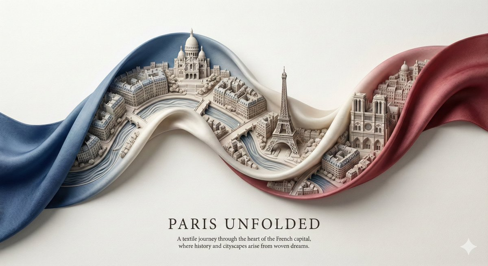

### Case 3: Interior Design Grid (Source @gokayfem) Model: Nano Banana Pro

```text
Professional architectural photography 4x4 grid showcasing identical room layout transformed through 16 distinct interior design styles. All furniture placement, room geometry, and spatial composition must exactly match the provided depth map reference. Camera: consistent 3/4 angle, 24mm tilt-shift lens, f/8, tripod-mounted. Only materials, colors, textures, and decorative elements change—never position or scale of objects.CRITICAL CONSTRAINT: Furniture placement, room dimensions, window/door positions, and all object locations must remain pixel-perfect identical to the reference depth map across all 16 frames. The silhouette and spatial arrangement cannot change.
```

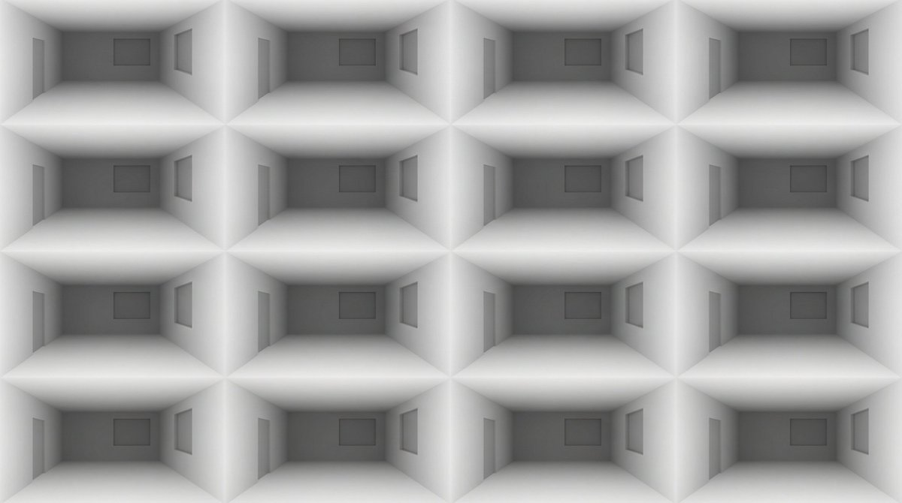

### Case 4: Wooden Miniature Figure (Source @Sheldon056) Model: Nano Banana Pro

```text
A hand-carved wooden miniature figure of [NAME], shaped with visible knife marks, natural grain texture, and smooth unfinished edges. Placed on a workshop table with carving tools, wood shavings, and soft warm directional lighting. 1080×1080.
```


### Case 5: Sadie Sink Dramatic (Source @Ankit_patel211) Model: Nano Banana Pro

```text
Transform the original photo into a dramatic, photorealistic, ultra-detailed set of 4 different styles, each a mid close up wide-angle shot with an extreme, dynamic camera angle (including more grid views from directly below or above), where one or more body parts are positioned right next to the lens and appear huge, the rest of the body recedes strongly in perspective, and the same person strikes a stylish, complex, powerful pose in a consistent, expanded version of the original environment, with cinematic lighting, high contrast, crisp textures, and precise color grading.
```

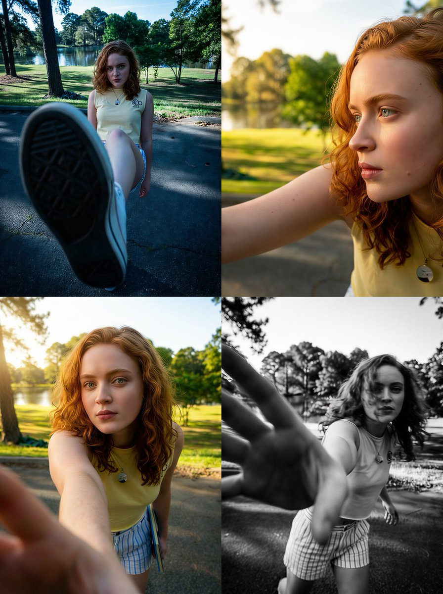

### Case 6: Pikachu Pose Scene (Source @Strength04_X) Model: Nano Banana Pro

```text
A stylish young man (1000% same person) standing confidently beside a giant, fluffy Pikachu in a bright monochromatic yellow studio setup. He wears a yellow hoodie, beige cargo shorts, white sneakers, and minimal accessories, creating a clean, coordinated aesthetic. A small orange kitten sits adorably at Pikachu’s feet, adding cuteness to the scene. Smooth soft lighting, high-end studio photography, 85mm lens, shallow depth of field,  look. ultra-realistic textures, vibrant colors, clean background, professionally composed hero-shot poster style. Crisp details, warm atmosphere, polished commercial.
```

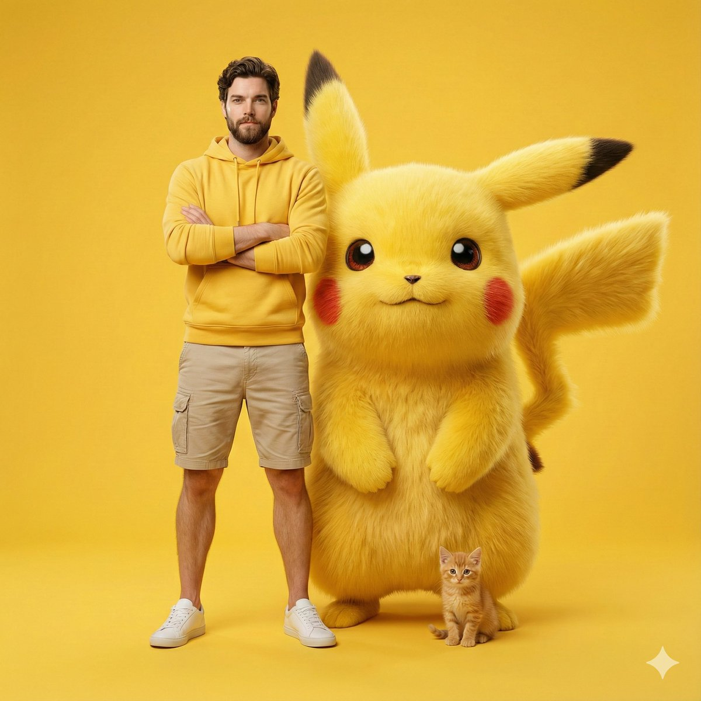

### Case 7: Strawberry Dress Collage (Source @NameIsSudee) Model: Nano Banana Pro

```text
{"realism_level":"Ultra-photorealistic","texture_quality":"8k","lighting_simulation":"Ray-traced studio lighting"}
```

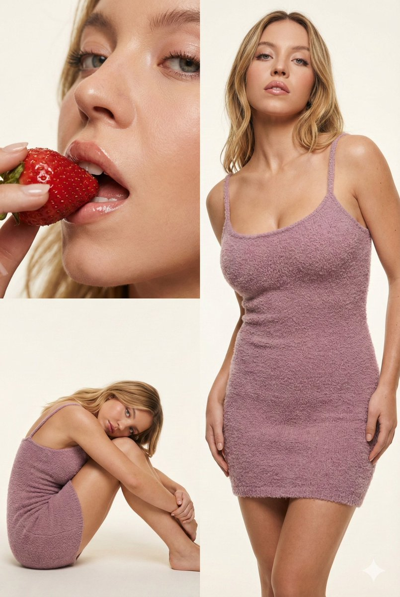

### Case 8: Sadie Sink Variations (Source @Ankit_patel211) Model: Nano Banana Pro

```text
{"image_generation_prompt":{"variations":{"count":4,"requirement":"each_must_be_unique_style"},"shot_composition":{"type":"mid_close_up_wide_angle","camera_angle":{"style":"extreme_dynamic","allowed_perspectives":["directly_below","directly_above","grid_views_multi_angle"]},"perspective_effects":{"near_lens_elements":"one_or_more_body_parts_positioned_adjacent_to_lens_appear_huge","background_elements":"remaining_body_recedes_strongly_in_perspective"}},"subject":{"identity":"same_person_across_all_variations","pose_requirements":{"style":"stylish_complex_powerful","consistency":"maintain_across_all_shots"}},"environment":{"base":"original_setting","modification":"expanded_version","consistency":"maintained_across_all_variations"},"technical_specifications":{"render_style":"photorealistic_ultra_detailed_dramatic","lighting":"cinematic","contrast":"high","textures":"crisp","color_grading":"precise"}}}
```

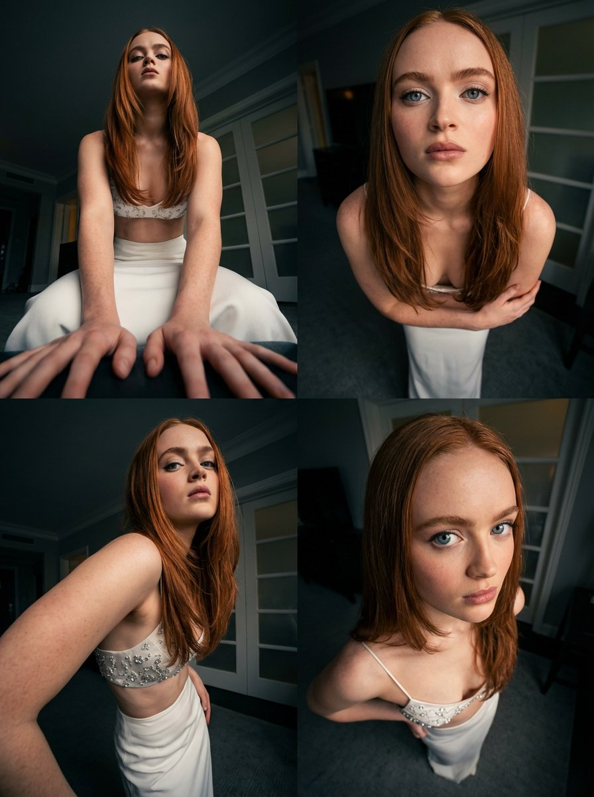

### Case 9: Conceptual Ad Framework (Source @aleenaamiir) Model: Nano Banana Pro

```text
A striking, conceptual advertisement for [BRAND NAME], featuring [PRODUCT] as the central hero element. The scene uses a bold visual metaphor to represent [CORE BENEFIT / BRAND VALUE — e.g. speed, strength, simplicity, luxury, reliability, innovation]. The [PRODUCT] is placed in an unexpected yet meaningful scenario, interacting with [SYMBOLIC ELEMENT — animal, object, environment, action] to instantly communicate the message without words. Motion, scale, or contrast is used to amplify impact. The background is [BACKGROUND STYLE — minimal / gradient / cinematic / surreal], ensuring maximum focus on the subject. Lighting is [LIGHTING STYLE — dramatic / soft / high-contrast / studio-clean], enhancing texture and form. Composition is dynamic and intentional, with strong negative space and a clear focal point. The overall style feels [STYLE — photorealistic / hyper-real / digital illustration / cinematic advertising], premium, modern, and campaign-ready. The mood is [EMOTION — powerful, playful, bold, aspirational, confident], designed to feel instantly iconic and memorable, like a global billboard or award-winning print ad.
```


### Case 10: Alpine Storyboard (Source @oggii_0) Model: Nano Banana Pro

```text
A 3x3 cinematic storyboard contact sheet consisting of 9 distinct panels arranged in a grid. The sequence features a young woman with platinum blonde hair in a frozen alpine winter setting. The panels display various angles and shots: Close-ups: Focusing on her rosy cheeks, blue-grey eyes, and snowflakes on her eyelashes. Medium shots: Showing her wrapped in a black wool coat and blue knit scarf, holding a bouquet of dried white flowers. Wide shots: Capturing her standing alone on the frozen lake with towering snowy mountains in the background. The lighting is consistent moody blue-hour twilight across all frames. High-quality film photography aesthetic, photorealistic, 8k resolution, coherent character and color grading.
```

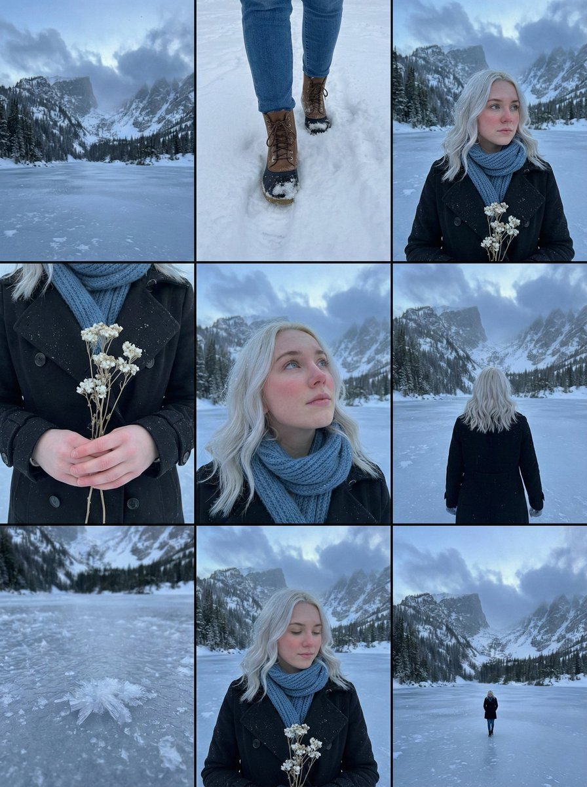

### Case 11: Tiny Builders Site (Source @aleenaamiir) Model: Nano Banana Pro

```text
A large-scale construction site where tiny [ENGINEERS / BUILDERS] assemble an oversized [EVERYDAY OBJECT] piece by piece. Scattered components, tools scaled correctly, realistic materials, dramatic worksite lighting.
```

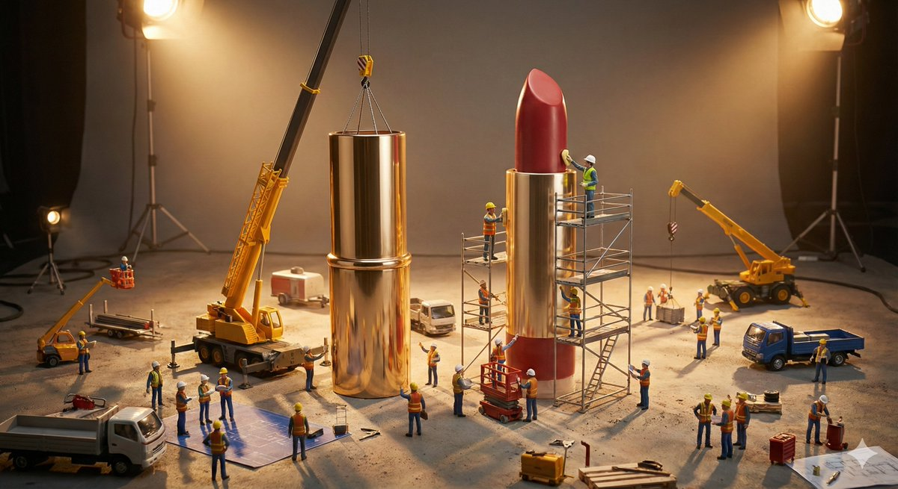

### Case 12: Add photos of food to this menu to each item of food (Source @icreatelife) Model: Nano Banana Pro

```text
Add photos of food to this menu to each item of food
```

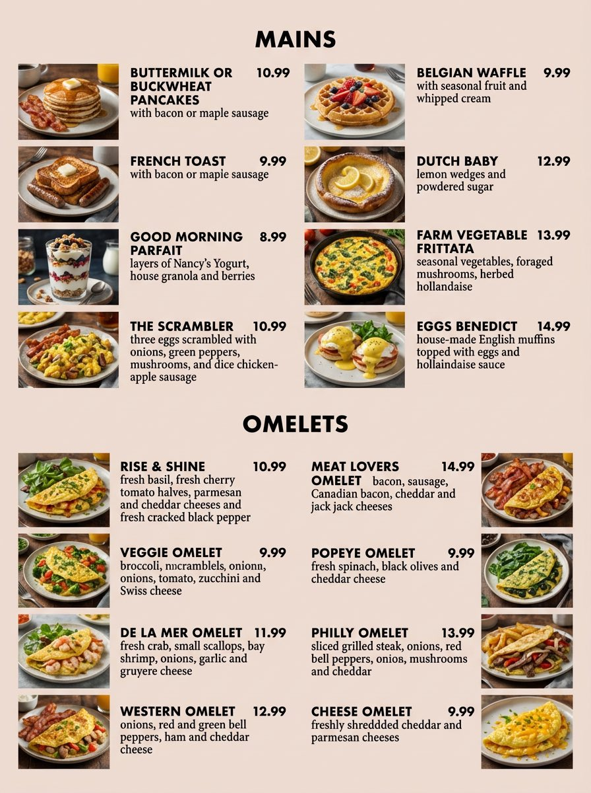

### Case 13: The Google Android robot, presented in a high-contrast (Source @Nano Banana Pro) Model: Nano Banana Pro

```text
The Google Android robot, presented in a high-contrast scientific studio render against a pure black void. This tight right-side profile features a false-color thermal X-ray aesthetic, where the transparent shell reveals a sharply detailed internal architecture of batteries, drivers, and sensors using a vibrant heatmap gradient. The colors shift from deep cool blues to intense yellows and red highlights, creating a futuristic, clinical look with orthographic perspective and a soft, neon-like glow.
```

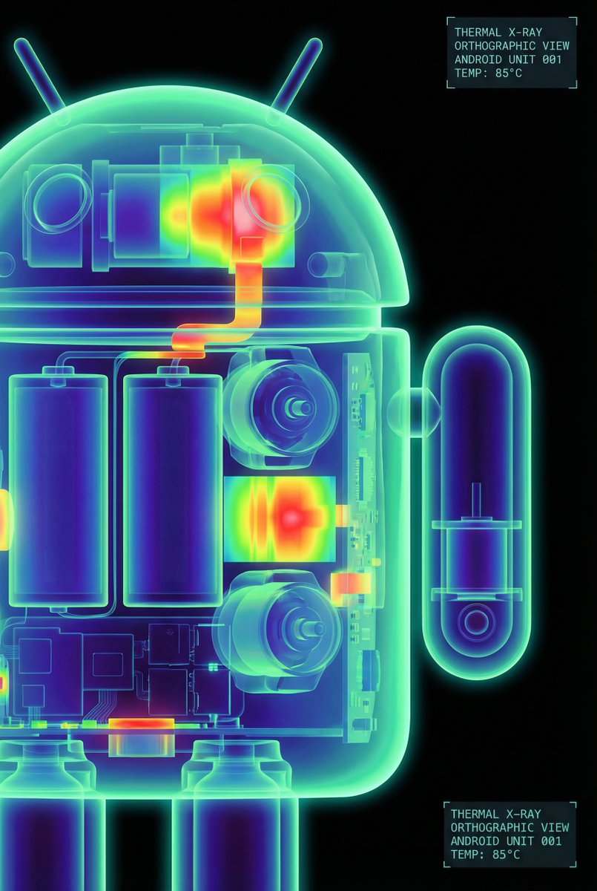

### Case 14: A photo of the world when GTA 6 is released. (Source @_philschmid) Model: Nano Banana Pro

```text
A photo of the world when GTA 6 is released.
```

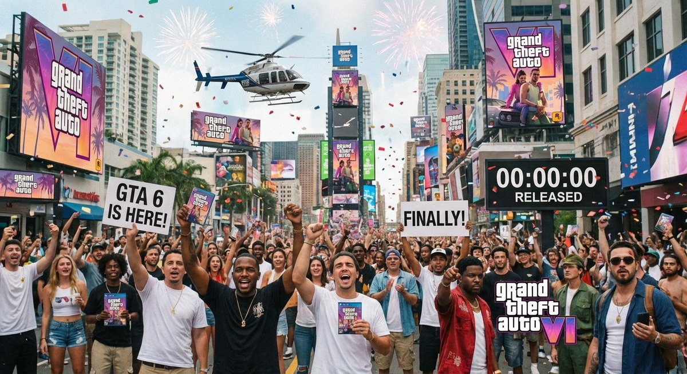

### Case 15: Cushion Transformation Prompt (Source @gizakdag) Model: Nano Banana Pro

```text
Nano Banana Pro prompt👇
```

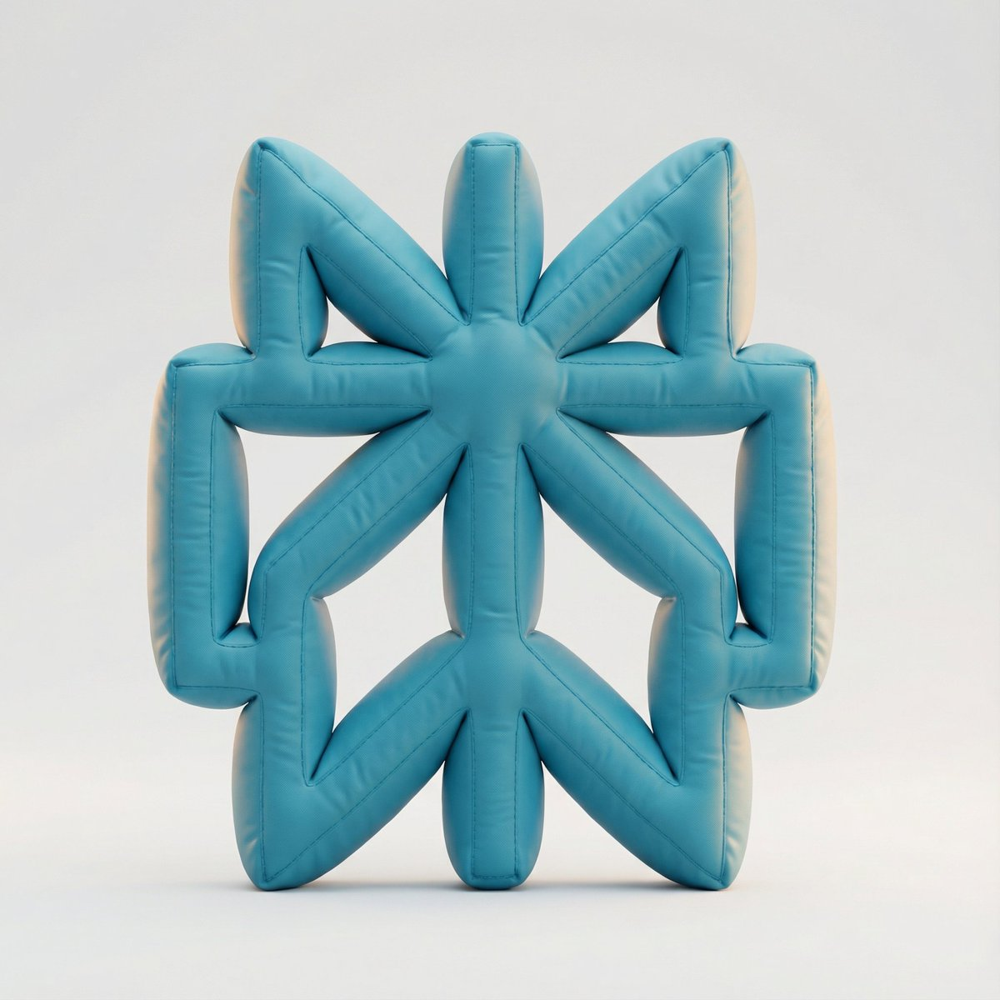

### Case 16: behind the scene shots of new live action remake of Quake - by Nano Banana Pro (Source @awesome_visuals) Model: Nano Banana Pro

```text
behind the scene shots of new live action remake of Quake - by Nano Banana Pro
```

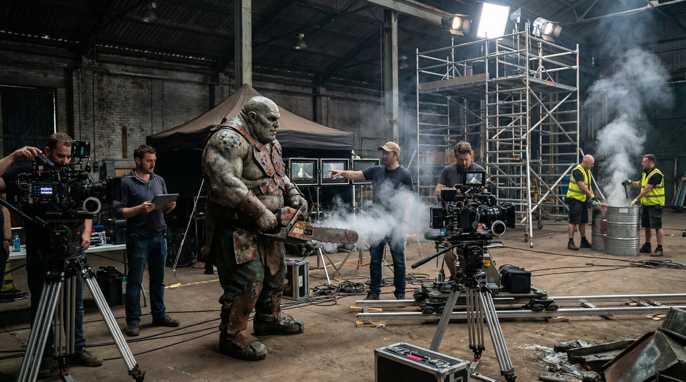

### Case 17: Lincoln, one of the top CEOs in the country (Source @maxescu) Model: Nano Banana Pro

```text
Lincoln, one of the top CEOs in the country
```

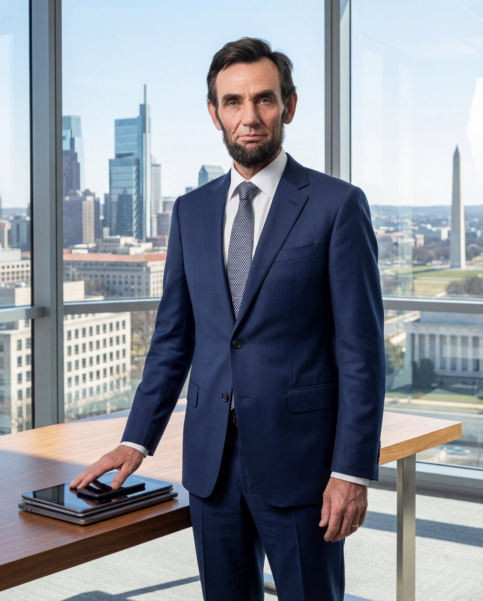

### Case 18: Nixon welcoming the King in his office inside the Watergate building (Source @maxescu) Model: Nano Banana Pro

```text
Nixon welcoming the King in his office inside the Watergate building
```

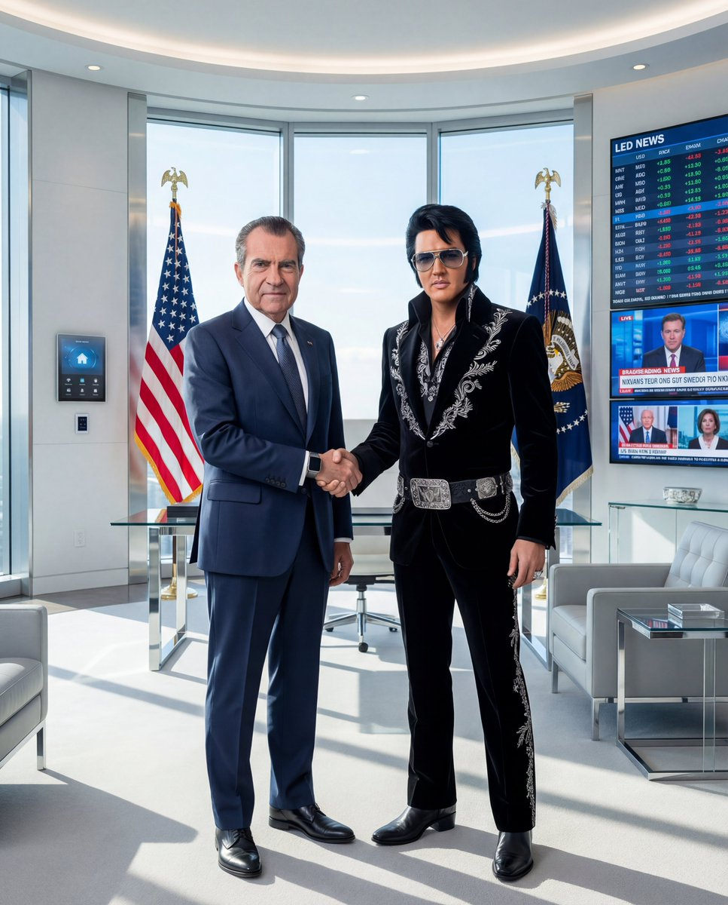

### Case 19: Icon Themes Collection (Source @NanoBanana) Model: Nano Banana Pro

```text
Create an image concept titled "Icon Themes Collection".
Style tags: Forest, Ambient, Casual.
Composition: strong focal point, balanced framing, and clear visual hierarchy.
Lighting: cinematic natural light with realistic shadows and subtle contrast.
Output quality: ultra-detailed, sharp textures, 4K resolution, clean color grading.
```

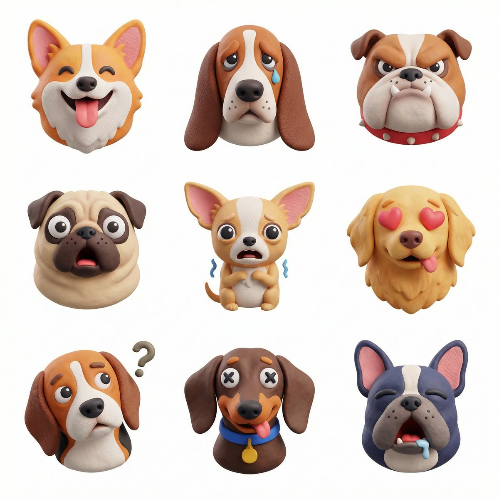

### Case 20: Perfume Explosion (Source @Strength04_X) Model: Nano Banana Pro

```text
Create an image concept titled "Perfume Explosion".
Style tags: Concept Art, Modern, Natural Light.
Composition: strong focal point, balanced framing, and clear visual hierarchy.
Lighting: cinematic natural light with realistic shadows and subtle contrast.
Output quality: ultra-detailed, sharp textures, 4K resolution, clean color grading.
```

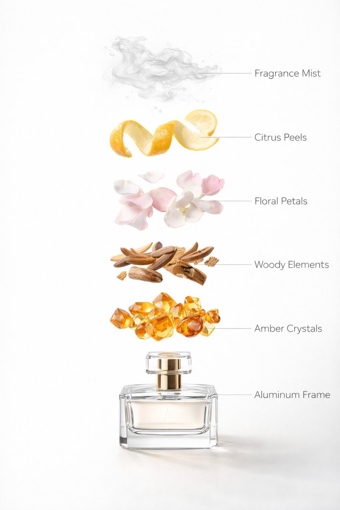

### Case 21: Exploded Food Info (Source @TechieSA) Model: Nano Banana Pro

```text
Create an image concept titled "Exploded Food Info".
Style tags: High Angle, Home, Long Exposure.
Composition: strong focal point, balanced framing, and clear visual hierarchy.
Lighting: cinematic natural light with realistic shadows and subtle contrast.
Output quality: ultra-detailed, sharp textures, 4K resolution, clean color grading.
```

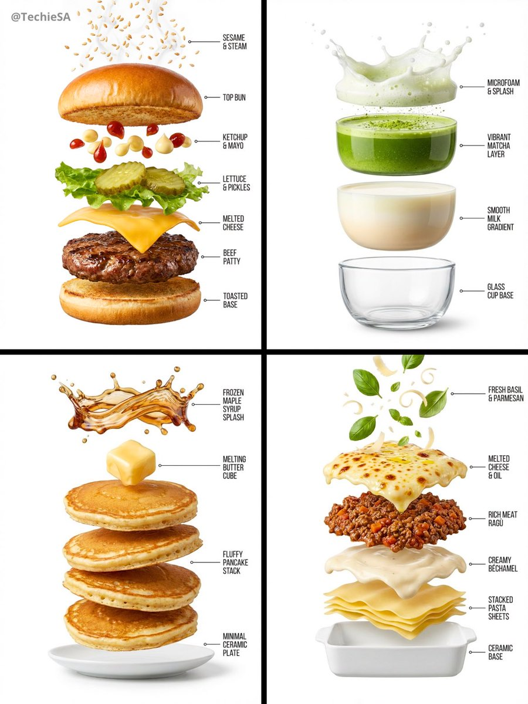

### Case 22: Luxury Skincare Photo (Source @Kerroudjm) Model: Nano Banana Pro

```text
Create an image concept titled "Luxury Skincare Photo".
Style tags: Close-up, Long Exposure, Bold.
Composition: strong focal point, balanced framing, and clear visual hierarchy.
Lighting: cinematic natural light with realistic shadows and subtle contrast.
Output quality: ultra-detailed, sharp textures, 4K resolution, clean color grading.
```

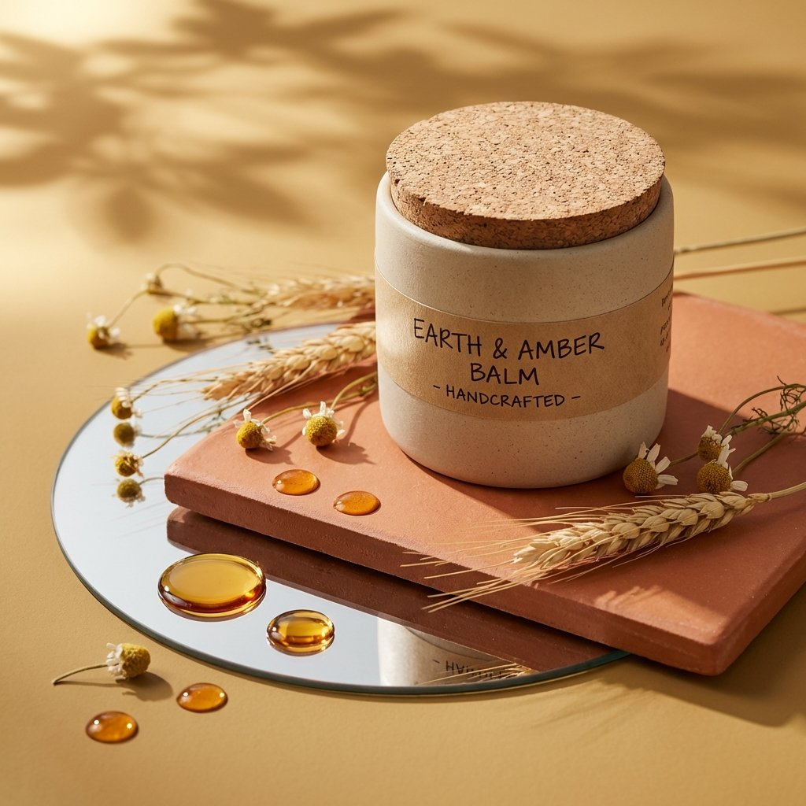

### Case 23: Blueprint Awakening (Source @AllaAisling) Model: Nano Banana Pro

```text
Create an image concept titled "Blueprint Awakening".
Style tags: Wide Angle, Natural Light, Urban.
Composition: strong focal point, balanced framing, and clear visual hierarchy.
Lighting: cinematic natural light with realistic shadows and subtle contrast.
Output quality: ultra-detailed, sharp textures, 4K resolution, clean color grading.
```

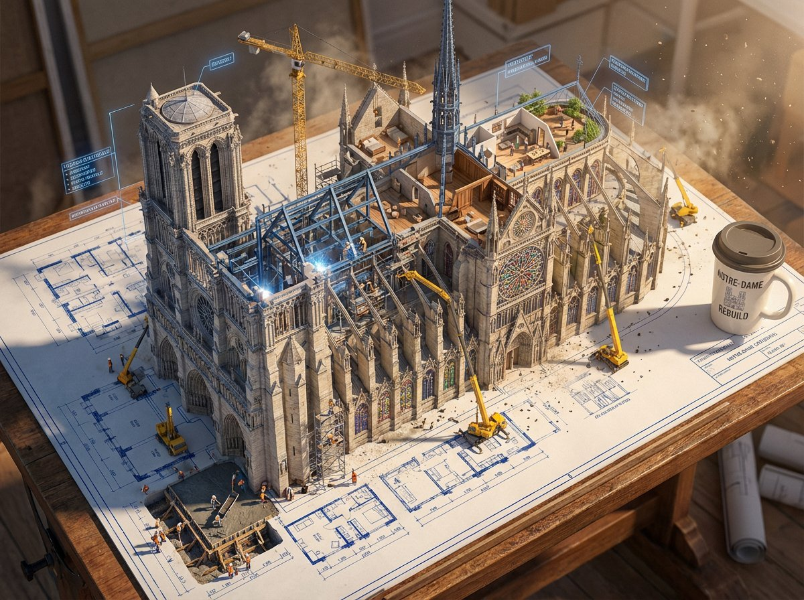

### Case 24: Exploded Mechanics (Source @azed_ai) Model: Nano Banana Pro

```text
Create an image concept titled "Exploded Mechanics".
Style tags: Fall, Café, Landscape.
Composition: strong focal point, balanced framing, and clear visual hierarchy.
Lighting: cinematic natural light with realistic shadows and subtle contrast.
Output quality: ultra-detailed, sharp textures, 4K resolution, clean color grading.
```


### Case 25: French Tips Stretch (Source @bananababydoll) Model: Nano Banana Pro

```text
Create an image concept titled "French Tips Stretch".
Style tags: Mysterious, Dark, Long Exposure.
Composition: strong focal point, balanced framing, and clear visual hierarchy.
Lighting: cinematic natural light with realistic shadows and subtle contrast.
Output quality: ultra-detailed, sharp textures, 4K resolution, clean color grading.
```

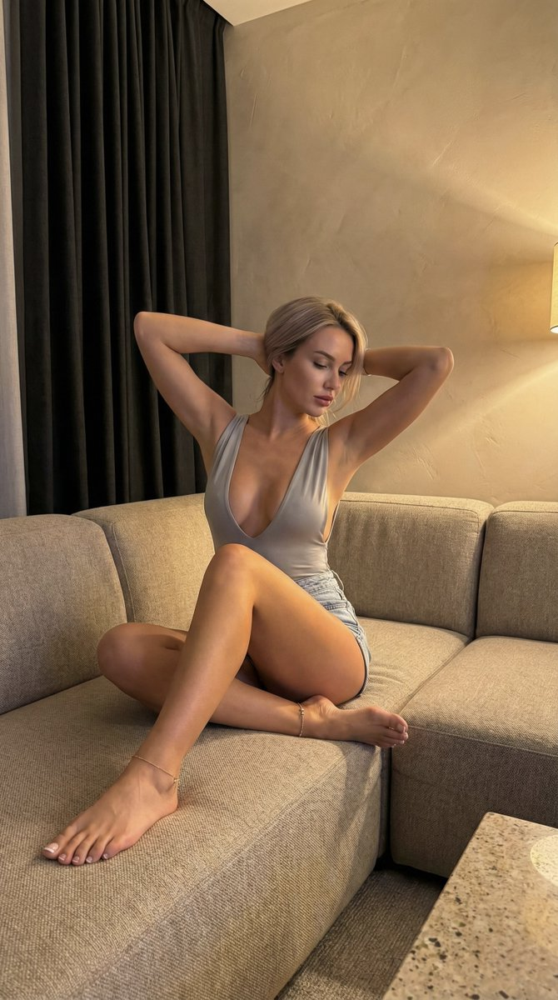

### Case 26: Day in Life Sheet (Source @techhalla) Model: Nano Banana Pro

```text
Create an image concept titled "Day in Life Sheet".
Style tags: Cinematic, Vibrant, Forest.
Composition: strong focal point, balanced framing, and clear visual hierarchy.
Lighting: cinematic natural light with realistic shadows and subtle contrast.
Output quality: ultra-detailed, sharp textures, 4K resolution, clean color grading.
```

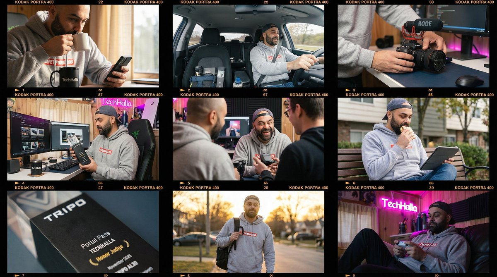

### Case 27: Product Close-up (Source @oggii_0) Model: Nano Banana Pro

```text
Create an image concept titled "Product Close-up".
Style tags: Natural Light, Elegant, Dramatic.
Composition: strong focal point, balanced framing, and clear visual hierarchy.
Lighting: cinematic natural light with realistic shadows and subtle contrast.
Output quality: ultra-detailed, sharp textures, 4K resolution, clean color grading.
```


### Case 28: [object Object] - AI Generated (Source @ShreyaYadav___) Model: Nano Banana Pro

```text
{"description":"A dramatic black-and-white close-up portrait of a woman standing in the rain.","subject":{"gender":"female","pose":"side profile, facing left","expression":"calm and pensive","details":{"hair":"long, wavy, wet strands falling forward","skin":"wet with visible raindrops","makeup":"soft natural makeup with defined lashes","wardrobe":"sleeveless top (minimal visible)"}},"environment":{"weather":"rainfall visible in the background","lighting":"soft, moody, directional light creating gentle highlights and shadows","tone":"dark, cinematic, high-contrast monochrome"},"composition":{"shot_type":"close-up portrait","focus":"sharp focus on the woman's face","background":"blurred, dark, deep bokeh"},"mood":"dramatic, emotional, introspective"}
```

![[object Object] - AI Generated](./nano-banana-prompts-images/155_G6ID7_ObIAABOJZ.jpg)

### Case 29: Room Furniture Viz (Source @NanoBanana) Model: Nano Banana Pro

```text
Show me how this room would look with furniture in it
```

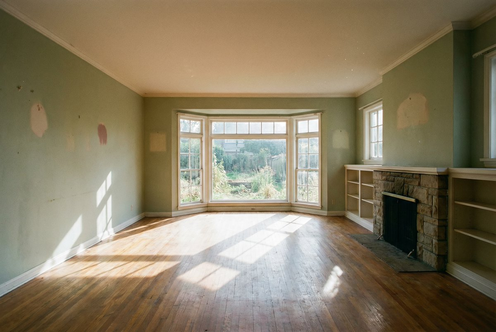

### Case 30: Street Schematic Diagram (Source @AmirMushich) Model: Nano Banana Pro

```text
[Create a hand drawn isometric schematic diagram of this street]
```

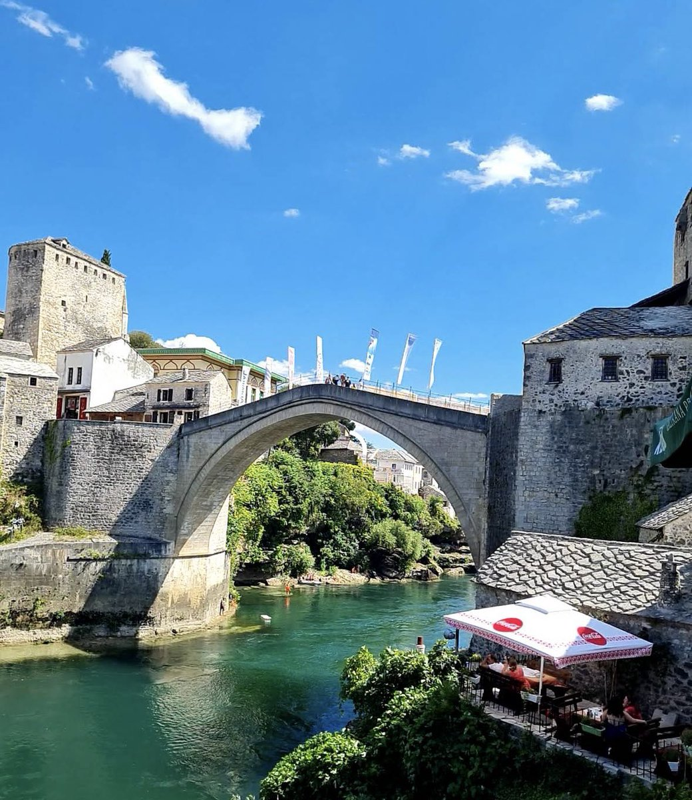

### Case 31: A miniature diorama of [CITY], condensed into a tiny tabletop world. (Source @aleenaamiir) Model: Nano Banana Pro

```text
A miniature diorama of [CITY], condensed into a tiny tabletop world. Iconic buildings simplified but recognizable, tiny people, vehicles, trees, and street details. Soft ambient lighting, tilt-shift photography style, museum-quality realism.
```

![A miniature diorama of [CITY], condensed into a tiny tabletop world.](./nano-banana-prompts-images/160_G8ShrmKa4AAJTo3.jpg)

### Case 32: MacBook Mockup Room (Source @gizakdag) Model: Nano Banana Pro

```text
Create a MacBook mockup placed in a minimalist room. Use the attached image on the laptop screen. A woman is sitting at the desk, using the computer, shown from behind.
```

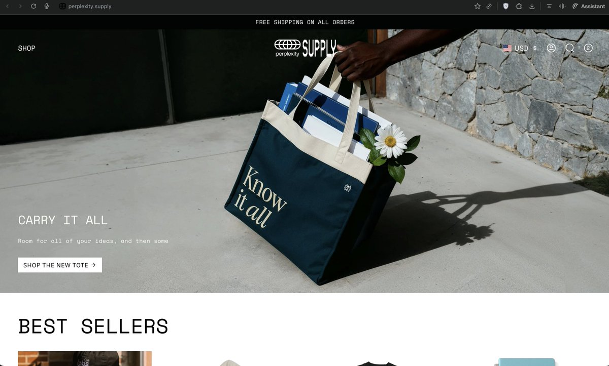

### Case 33: Object Civilization (Source @aleenaamiir) Model: Nano Banana Pro

```text
A colossal [EVERYDAY OBJECT] reimagined as a fully inhabited city. Tiny [PEOPLE / SOCIETY] build homes, roads, markets, and infrastructure directly into the object’s structure. Photoreal materials, lived-in wear, soft daylight, wide cinematic perspective with deep storytelling.
```


### Case 34: Cloud Continents (Source @umesh_ai) Model: Nano Banana Pro

```text
A photorealistic image of a cloud in the sky, uniquely shaped like all the continents of the world, with clear, distinct outlines of each continent visible within the cloud formation. The background is a bright blue sky with a few other smaller, normal clouds scattered around. The sunlight is subtly illuminating the cloud, highlighting its unique shape
```


### Case 35: Miniature Diorama Scene (Source @aleenaamiir) Model: Nano Banana Pro

```text
A miniature diorama showing tiny [PEOPLE / CHARACTERS] struggling with an oversized [EVERYDAY OBJECT]. Exaggerated scale contrast, expressive poses, cinematic lighting. Ultra-detailed props, handcrafted realism, macro lens perspective.
```

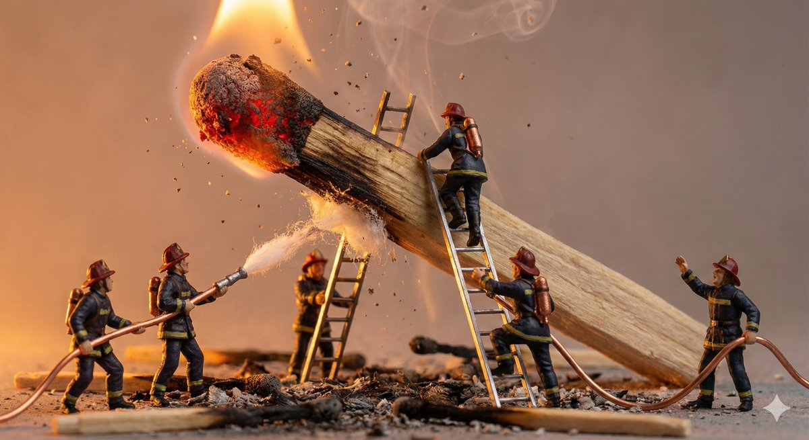

### Case 36: Ad Recreation Prompt (Source @VibeMarketer_) Model: Nano Banana Pro

```text
Recreate this ad concept using my product instead of theirs. Keep the same mood, lighting, composition, and overall vibe. Remove all competitor branding.
Replace the product with the one from my uploaded image and adapt all background elements, props, and surrounding textures to be visually relevant to my product’s brand, flavor profile, and aesthetic — not the original brand’s. Maintain photorealism and accurate product proportions.
```

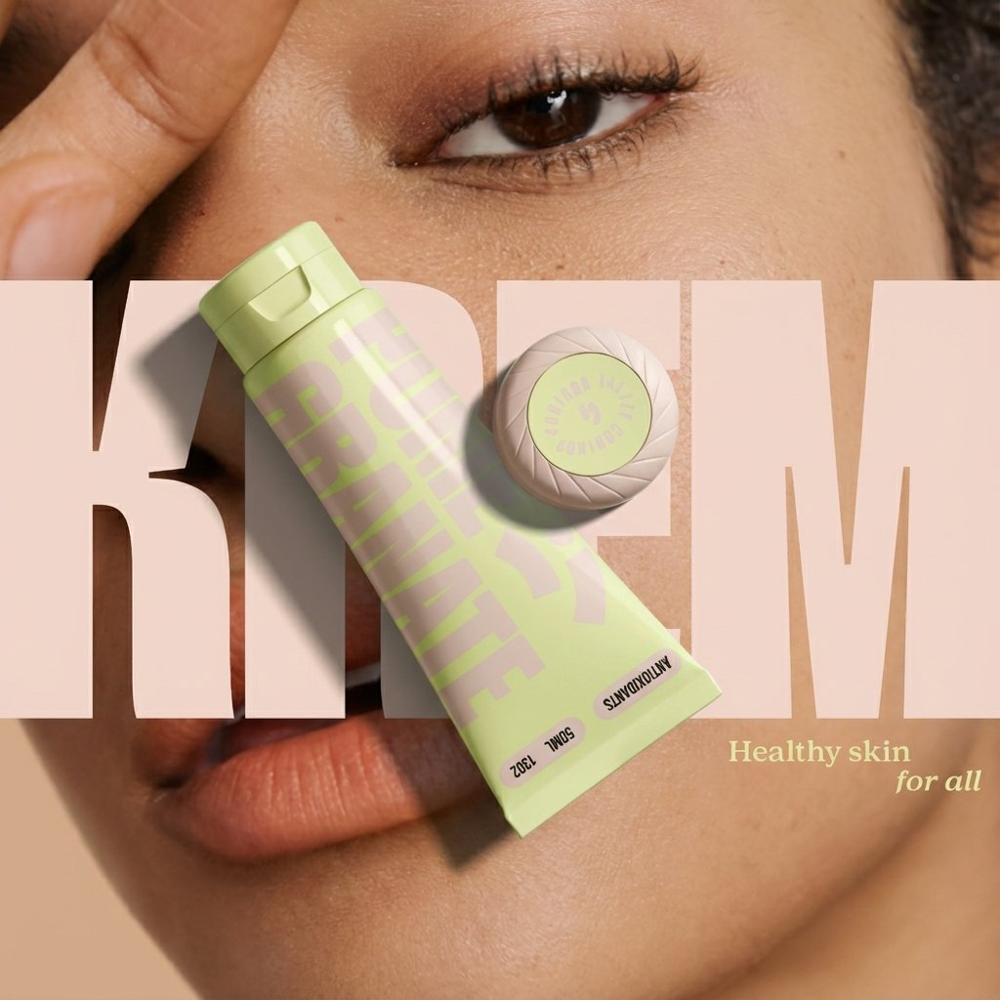

### Case 37: Christmas Product Shoot (Source @aleenaamiir) Model: Nano Banana Pro

```text
A luxury Christmas-themed product photoshoot set in a [COZY / STUDIO / OUTDOOR] environment. Place the uploaded product image as the hero object, standing upright at the center of the frame. The product must remain EXACTLY unchanged in [shape, size, material, colors, label design, typography, logos, and all visible text]. Do not modify, recreate, translate, enhance, or stylize any product text. Scene & background: A festive [BACKGROUND TYPE — e.g. wooden windowsill, velvet studio backdrop, snowy landscape] with [SEASONAL DETAILS — e.g. softly falling snow, blurred Christmas tree lights, winter village bokeh]. Foreground includes subtle holiday accents such as [FESTIVE PROPS — e.g. holly, ribbons, ornaments, fairy lights], placed naturally and never covering the product. Styling: Optional festive accessory on the product such as [HAT / SCARF / RIBBON], perfectly fitted without altering the product’s structure or covering the label. Lighting & camera: Warm golden Christmas lighting contrasted with cool winter tones. Soft diffused light, gentle rim lighting for depth, no glare or harsh reflections on the product text. Shallow depth of field with a softly blurred background. Shot on DSLR, [LENS — e.g. 85mm], professional product photography. Quality & mood: Ultra-high resolution, photorealistic textures, premium holiday advertising aesthetic, clean editorial composition, cozy, elegant, and festive.
```

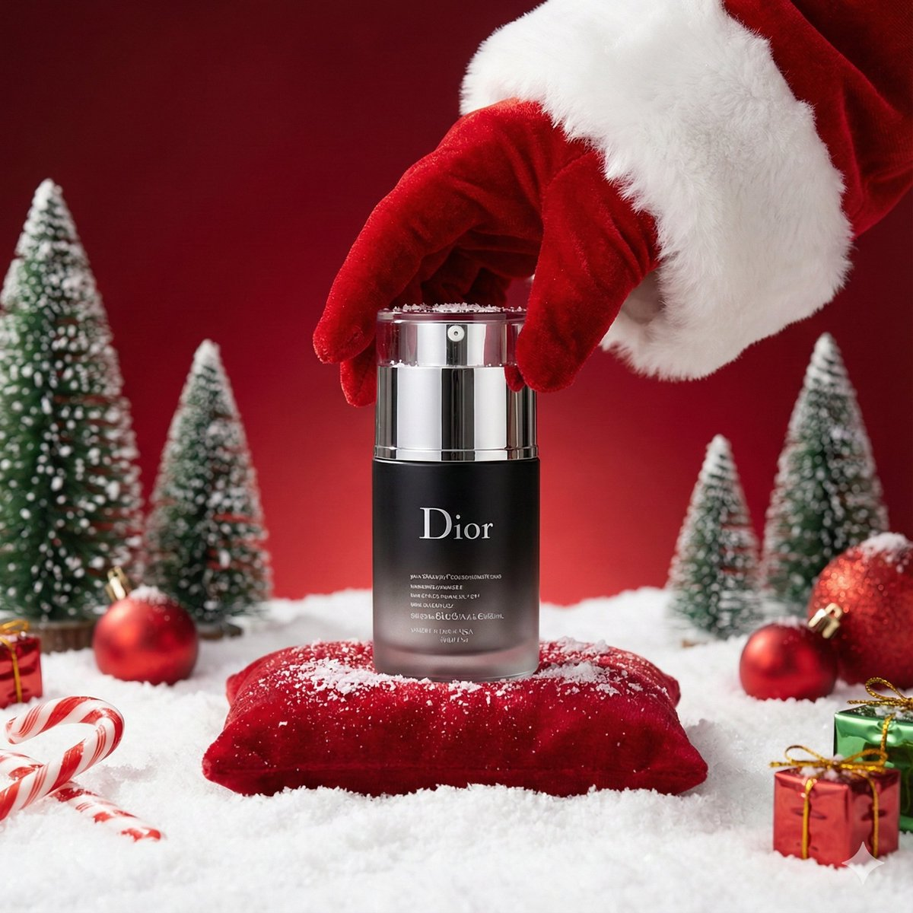

### Case 38: Gemini 3 Flash Article (Source @NanoBanana) Model: Nano Banana Pro

```text
Use search to find how the Gemini 3 Flash launch has been received. Use this information to write a short article about it (with headings). Return a photo of the article as it appeared in a glossy magazine. Show the magazine cover (Pro Bananas), and the two page spread of the article about Gemini 3 Flash.
```


### Case 39: A SURREAL TRAVEL-THEMED DIGITAL ARTWORK DEPICTING (Source @Zar_xplorer) Model: Nano Banana Pro

```text
A SURREAL TRAVEL-THEMED DIGITAL ARTWORK DEPICTING A HAND HOLDING A SLEEK, FRAMELESS SMARTPHONE OR TABLET TILTED AT A 45-DEGREE ANGLE. THE DEVICE DISPLAYS A HIGH-RESOLUTION IMAGE OF THE EIFFEL TOWER, SEAMLESSLY BLENDING INTO THE REALISTIC LANDSCAPE BEHIND IT. THE EIFFEL TOWER EXTENDS OUT OF THE SCREEN AND RISES INTO THE SKY, CREATING A HYPER-REALISTIC 3D ILLUSION. HOT AIR BALLOONS FLOAT AROUND THE TOWER, AND WHITE DOVES FLY ACROSS A SOFT GOLDEN SUNSET SKY. THE BOLD TEXT "PARIS" APPEARS IN THE CLOUDS BEHIND THE TOWER IN A DOUBLE-EXPOSURE STYLE, USING A CLEAN, MODERN SANS-SERIF FONT. THE OVERALL STYLE IS DREAMY, PHOTOREALISTIC, AND VIBRANT - PERFECT FOR A LUXURY TRAVEL CAMPAIGN OR SOCIAL MEDIA ADVERTISEMENT
```


### Case 40: Fantasy Soda Commercial (Source @Sheldon056) Model: Nano Banana Pro

```text
A vibrant fantasy-style soda commercial where a playful young man surfs an energetic orange soda wave exploding from a cold Fanta can. Juicy orange slices, bubbly liquid arcs, exaggerated motion, warm sunlight, colorful gradient background, joyful expression, dynamic pose, hyper-realistic splash effects, cinematic advertising look, 8K, ultra sharp, bold colors, no text, no watermark
```

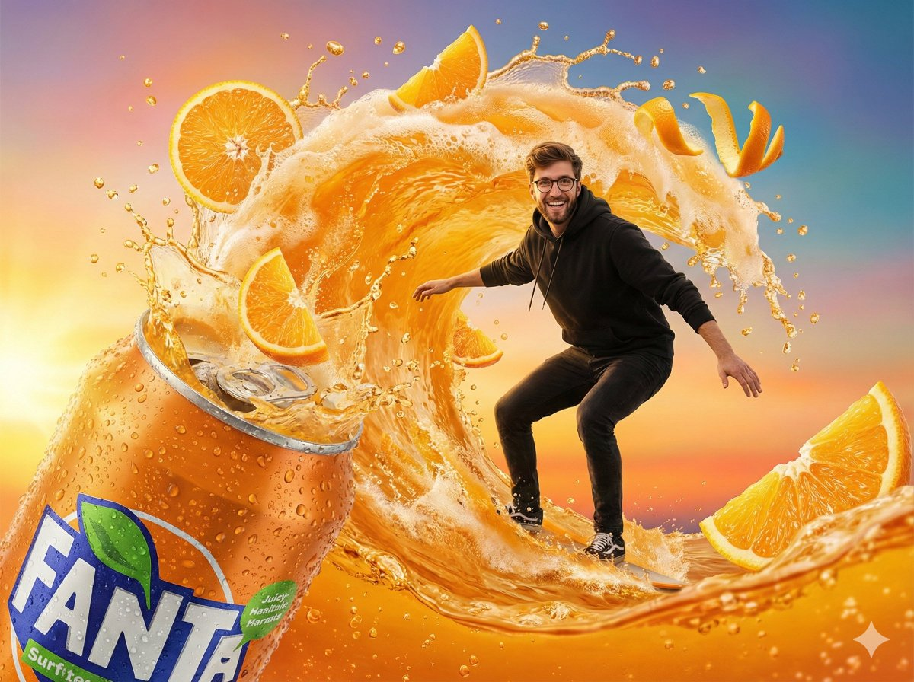

### Case 41: A hyper-detailed folded-paper blueprint of [character] (Source @rovvmut_) Model: Nano Banana Pro

```text
A hyper-detailed folded-paper blueprint of [character], where the character is constructed from precise geometric folds and crease lines, overlaid with subtle blueprint markings, measurement lines, and paper annotations. Minimal color palette, off-white paper with faint ink lines. Studio lighting, crisp shadows, architectural art style, photorealistic paper detail. 1080x1080 square format.
```

![A hyper-detailed folded-paper blueprint of [character]](./nano-banana-prompts-images/252_G8Qohrxa4AAXuGO.jpg)

### Case 42: Diorama Lamp Creation (Source @NanoBanana) Model: Nano Banana Pro

```text
A [subject] is [doing something] in a [place]. Isometric 3D cube diorama with internal lighting, cute chibi figurine style, matte PVC material, big head/small body. Neutral background on a table in a dark room. Enclosed in a cube. Fill the diorama with many cute little details. Add delicate imperfections like dust, scratches and textures to make it real.
```

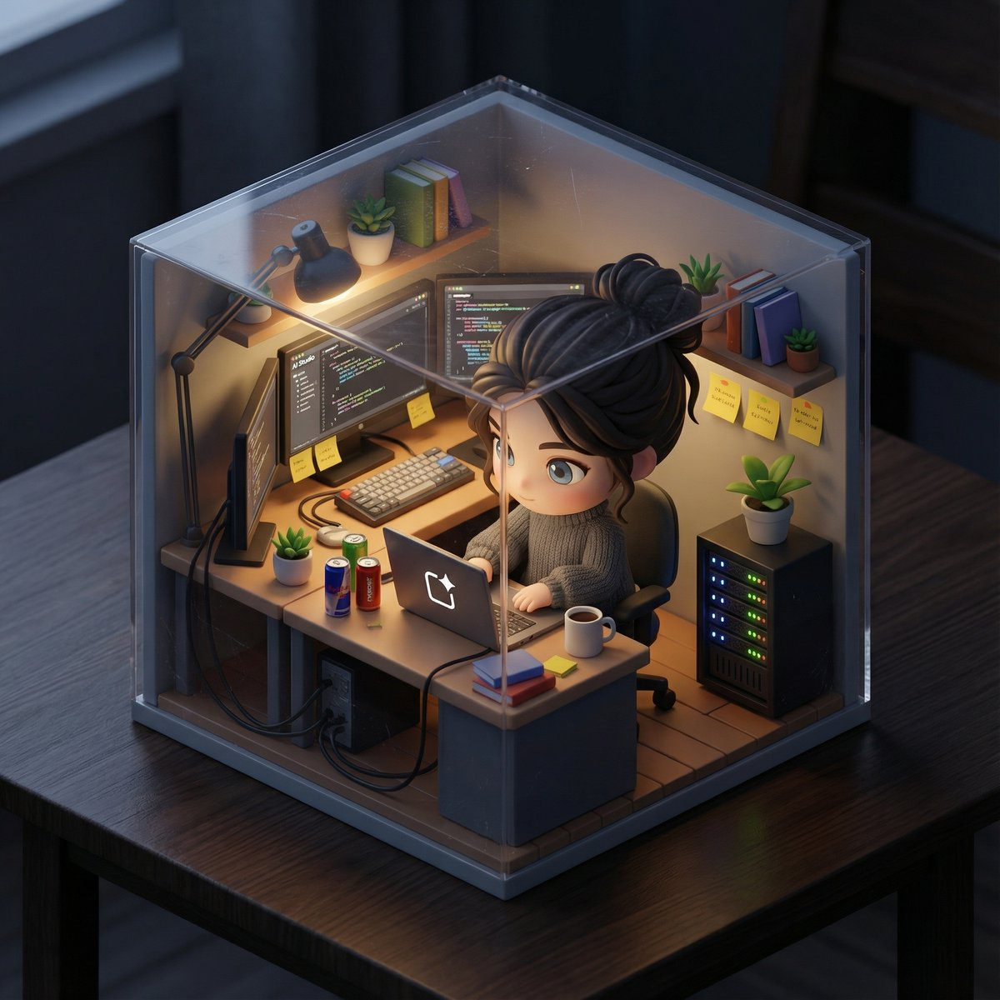

### Case 43: Advertising-style food photography of (Source @NanoBanana) Model: Nano Banana Pro

```text
Advertising-style food photography of [subject 1] arranged on a rustic table, with [subject 2] floating above in mid-air and a splash of [subject 1] frozen in motion. High-resolution photo manipulation with selective soft focus, clean negative space for text, dramatic lighting, and crisp detail.
```


### Case 44: In a 3x3 grid, show this character in different angles, keep the scene same, Random poses. (Source @ShreyaYadav___) Model: Nano Banana Pro

```text
In a 3x3 grid, show this character in different angles, keep the scene same, Random poses.
```

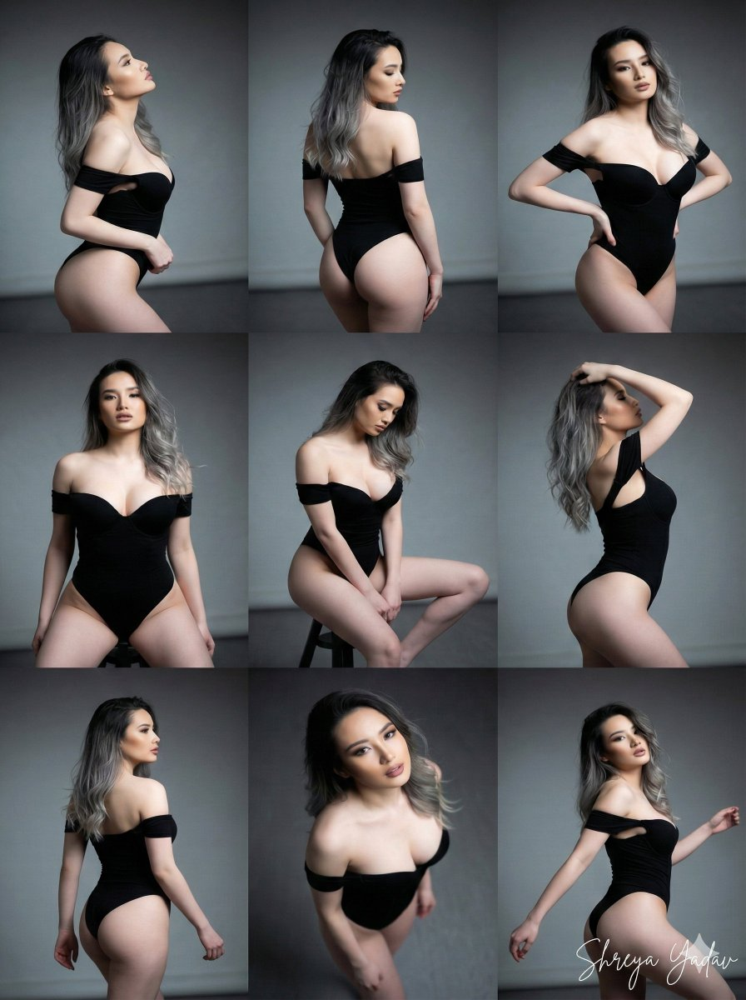

### Case 45: Generate the holiday photo of this person through the ages up to 80 years old (Source @minchoi) Model: Nano Banana Pro

```text
Generate the holiday photo of this person through the ages up to 80 years old
```

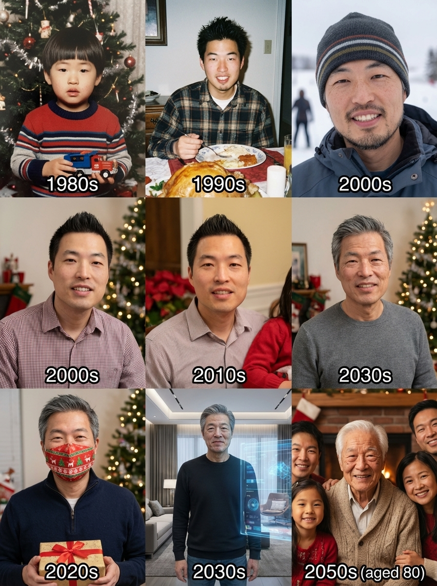

### Case 46: Create an infographic that shows how to make Matcha. (Source @CodeByPoonam) Model: Nano Banana Pro

```text
Create an infographic that shows how to make Matcha.
```

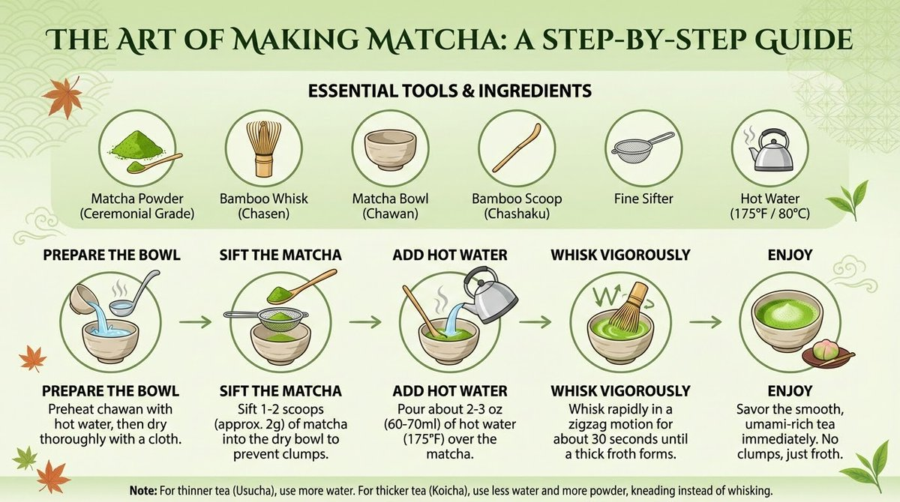

### Case 47: Create a visual in the style of a comic strip based on the secret message" (Source @LinusEkenstam) Model: Nano Banana Pro

```text
Create a visual in the style of a comic strip based on the secret message"
```

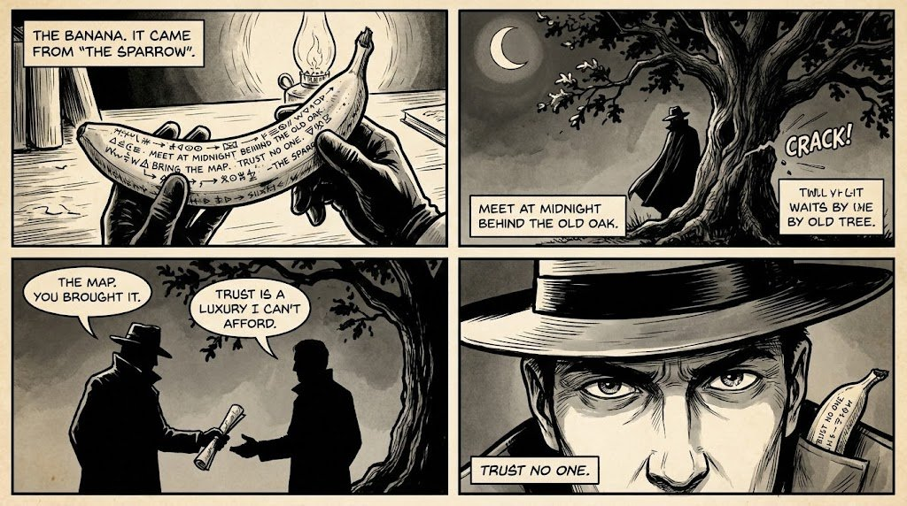

### Case 48: nano banana, how do you tie a tie? (Source @AniBaddepudi) Model: Nano Banana Pro

```text
nano banana, how do you tie a tie?
```

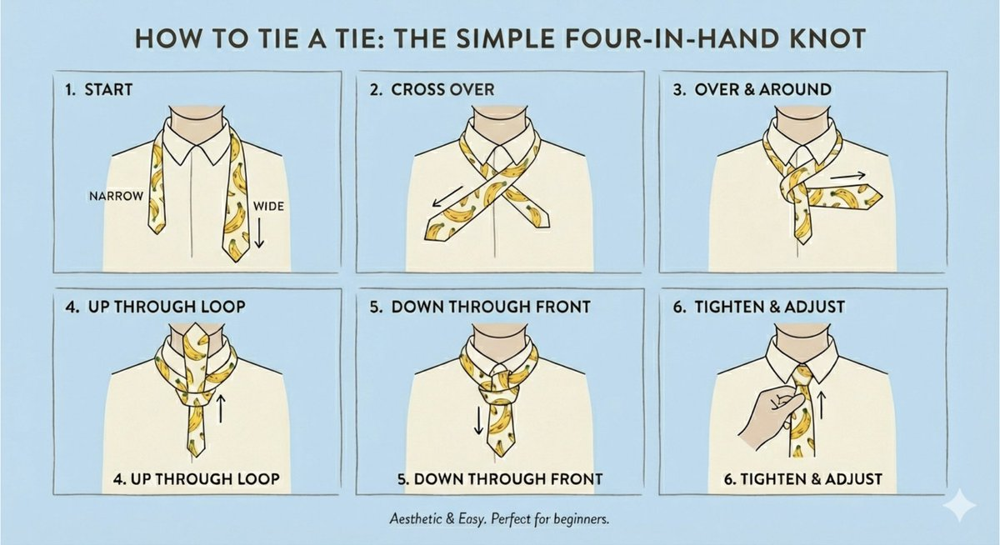

### Case 49: Zoom in on the toes (Source @CHAO2U_AI) Model: Nano Banana Pro

```text
Zoom in on the toes
```

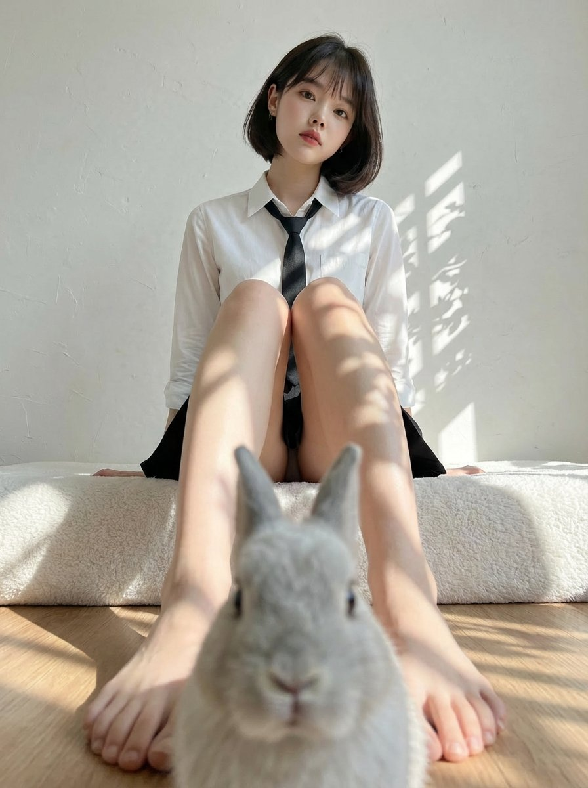

### Case 50: German soldiers waving the flag in Berlin (Source @maxescu) Model: Nano Banana Pro

```text
German soldiers waving the flag in Berlin
```

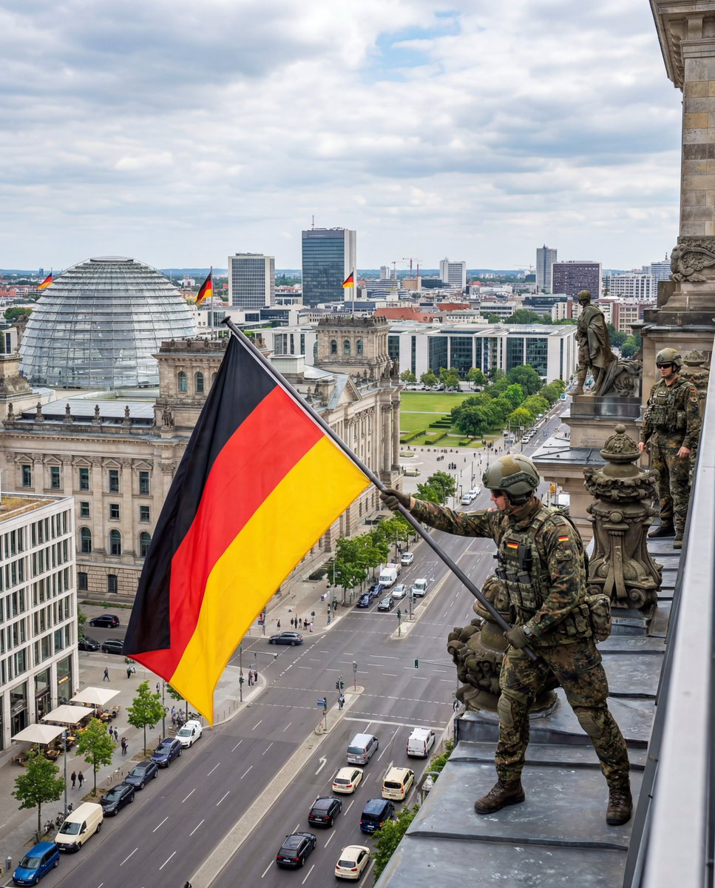

## How to Use These Prompts

1. Choose a prompt close to your target output.
2. Replace placeholders with your own content.
3. Keep core structure, but shorten when results drift.
4. Generate multiple variants and compare quality.
5. Visit the live library for complete prompt text.

- Live library: [https://banana2.ai/nano-banana-prompts](https://banana2.ai/nano-banana-prompts?utm_source=github&utm_medium=readme&utm_campaign=nano_banana_prompts)

## FAQ

### Are these full prompts?
No. This repo is a curated preview. Open the live library for complete text and ongoing updates.

### Can I generate these images directly?
The original website provides image generation capability. Please try it yourself.

### Can I use these prompts commercially?
Review tool policies and original source terms before commercial use.

## Final CTA

**[Open Nano Banana Prompts Library](https://banana2.ai/nano-banana-prompts?utm_source=github&utm_medium=readme&utm_campaign=nano_banana_prompts)**

---

Attribution policy: this repo keeps creator handles and source links whenever available.


